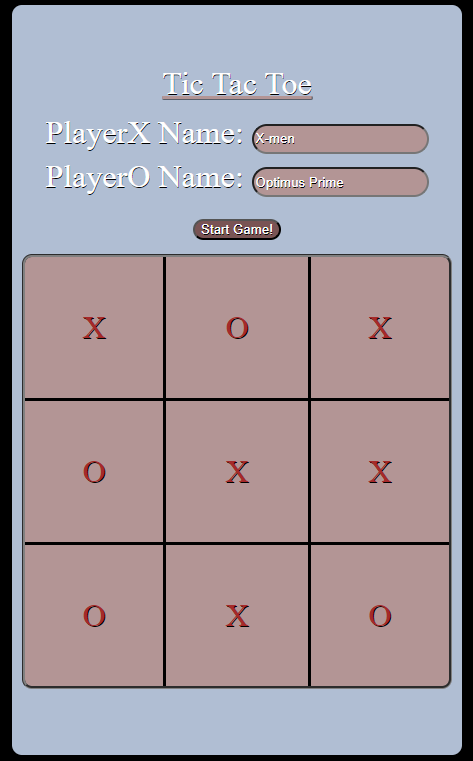

# Tic-Tac-Toe

Welcome to the Tic-Tac-Toe game project! This is a simple web-based implementation of the classic two-player game where players take turns marking spaces on a 3x3 grid. The objective is to get three of your marks in a row, either horizontally, vertically, or diagonally.

## Features

- **Player Input:** Enter custom names for Player X and Player O before starting the game.
- **Interactive Gameboard:** Click on any empty cell to make your move. Player X always goes first.
- **Win Detection:** The game automatically detects if Player X or Player O wins and displays a pop-up announcement.
- **Responsive Design:** The game adjusts to different screen sizes for an optimal experience on any device.
  
## Demo


## How to Play

1. Enter the names for Player X and Player O in the input fields.
2. Click the "Start Game" button to begin.
3. Players take turns clicking on the grid to place their marks (X or O).
4. The first player to get three of their marks in a row (horizontally, vertically, or diagonally) wins.
5. The game will declare a winner with a pop-up.

## Project Structure

The project is divided into three main files:

- `index.html`: The structure of the game, including the layout for player names, the game board, and the winner announcement.
- `style.css`: The styling of the game, defining how elements like the game board, buttons, and dialog boxes look.
- `script.js`: The logic behind the game, handling player turns, board updates, winner detection, and more.

## Files

- **HTML:**
  - Renders the game interface.
  - Players enter their names and interact with the game board.
  
- **CSS:**
  - Styles the layout and colors.
  - Provides basic responsiveness and game aesthetic.

- **JavaScript:**
  - Controls the game logic.
  - Handles moves, turn switching, winner detection, and UI updates.

## How to Run the Game

To run the game on your local machine:

1. Clone the repository:
   ```bash
   git clone https://github.com/Anthony-Mendoza-Reitor/tic-tac-toe.git
